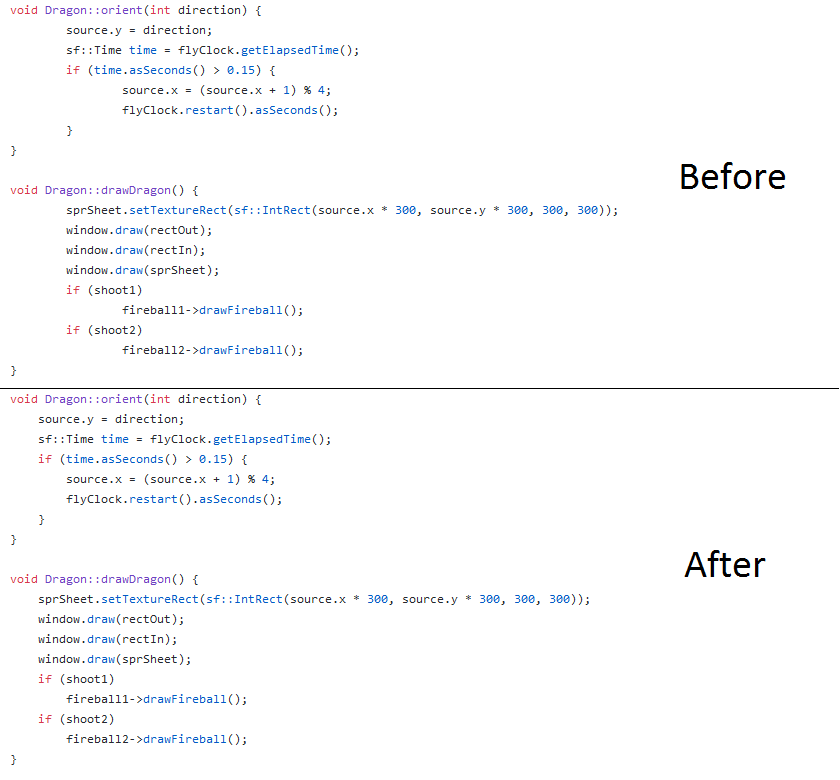

# Git Tab Viewer
> Firefox extension for changing the default tab size on github editor.

## Installation

Install it from [Firefox ADD-ONS store](https://addons.mozilla.org/en-US/firefox/addon/gittabviewer/)

## Working

Forces default view on github webpage editor with 4-spaced tabs instead of 8-spaced tabs.

